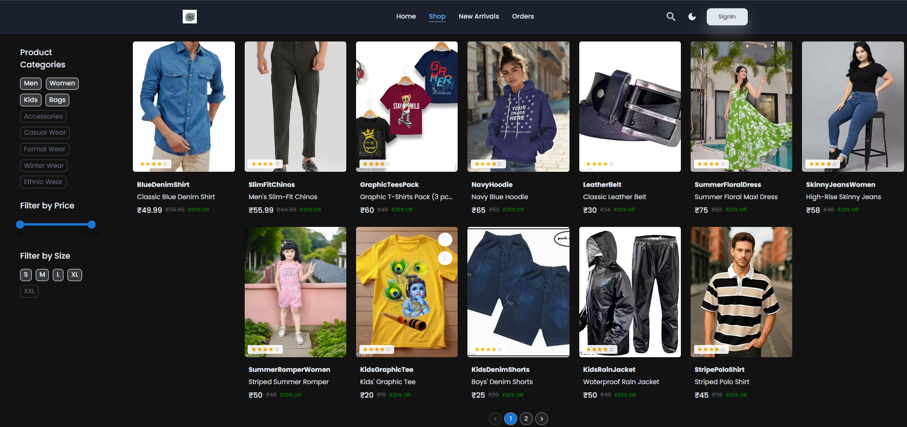
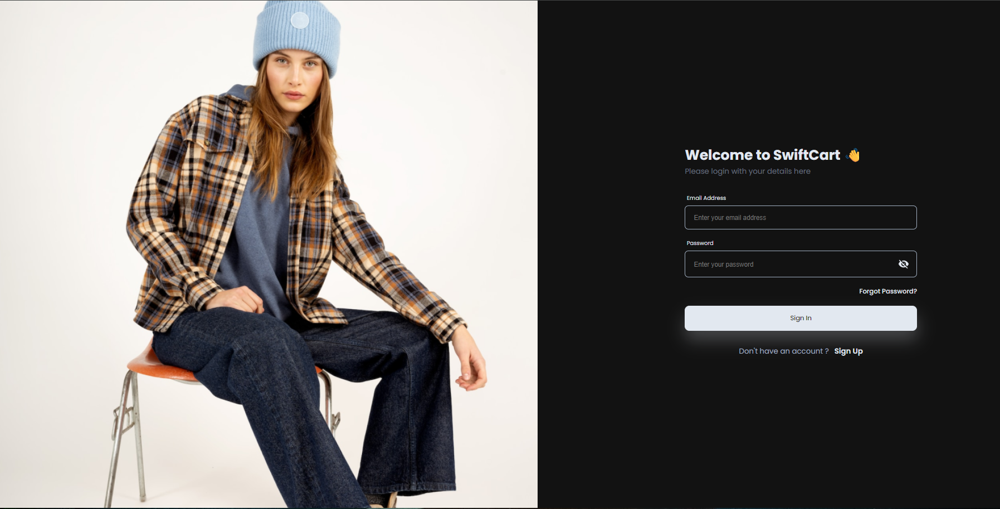
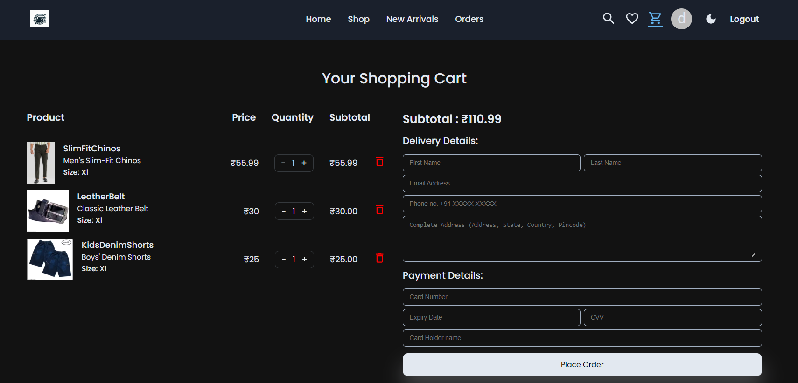

## 🛒 E-commerce Website

[](./Licence) 
[](https://reactjs.org/) 
[](https://nodejs.org/) 
[](https://www.mongodb.com/)

An elegant and modern **e-commerce platform** built with **React.js** & **Node.js**.  
This application allows users to register, sign in, browse products, add to cart, and prepare for checkout.  

It’s **modular, responsive, and extendable**, making it ideal for **learning, portfolio showcase, or real-world use**.  

---

## 📑 Table of Contents
- [🚀 Features](#-features)  
- [📁 Project Structure](#-project-structure)  
- [🛠️ Tech Stack](#️-tech-stack)  
- [⚡ Prerequisites](#-prerequisites)  
- [🧑‍💻 Installation & Setup](#-installation--setup)  
- [📸 Screenshots](#-screenshots)  
- [🤝 Contributing](#-contributing)  
- [📜 License](#-license)  

---

## 🚀 Features

- 🔐 **User Authentication** (Sign Up & Sign In)  
- 🛍️ **Product Listing & Details Pages**  
- 🧭 **Intuitive Navigation Bar**  
- 🎨 **Responsive UI** with reusable React components  
- ⚙️ **Redux Toolkit for State Management**  
- 🖼️ **Static Assets & Theming**  
- 📦 **Backend-ready** with Express & MongoDB models  

---

## 📁 Project Structure

```bash
Ecommerce-Website-main/
├── client/                     # Frontend (React.js)
│   ├── public/                 # Static assets (favicon, logos, manifest)
│   └── src/
│       ├── api/                # API integration files
│       ├── components/         # Reusable UI components
│       │   └── cards/          # Product-related UI cards
│       ├── pages/              # Page components (Home, Cart, Auth, etc.)
│       ├── redux/              # Redux store & slices
│       │   └── reducers/       # Reducer files
│       ├── utils/              # Utility functions & constants
│       │   └── Images/         # Project images
│       ├── App.js              # Root App component
│       ├── index.css           # Global styles
│       └── index.js            # React entry point
│   ├── README.md
│   ├── package.json
│   ├── package-lock.json
│   └── static.json
│
├── server/                     # Backend (Node.js / Express)
│   ├── controllers/            # Business logic (Products, User)
│   ├── middleware/             # Auth & token validation
│   ├── models/                 # MongoDB models (Orders, Products, Users)
│   ├── routes/                 # API routes
│   ├── error.js                # Error handling
│   ├── index.js                # Express app entry point
│   ├── package.json
│   └── package-lock.json
│
├── .gitignore
├── README.md
├── image.png                   # Preview image / screenshot

```


---

## 🛠️ Tech Stack

- **Frontend:**
     - ⚛️ React.js
     - 📦 Redux Toolkit
     - 🎨 CSS (Responsive Design)
- **Backend:**
     - 🟢 Node.js
     - 🚏 Express.js
     - 🍃 MongoDB (via Mongoose models included)
- **Others:**
     - 🌐 Axios (API calls)
     - 🔑 JWT (token-based authentication placeholder)

---


## ⚡ Prerequisites
- Make sure you have installed:
     - Node.js(>= 14.x recommended)
     - npm or yarn package manager
 
---


## 🧑‍💻 How to Run Locally

1. **Clone the repository:**

   ```bash
   git clone https://github.com/your-username/ecommerce-website.git
   cd ecommerce-website
   ```

# Setup client (frontend):
```bash
  npm install
  npm start
```

Visit http://localhost:3000 to view the app.

# Setup server (backend):
```bash
 cd ../server
 npm install
 npm start
```
Runs on: http://localhost:5000

---


### 📸 Screenshots
<p align="center">
  
  
  
  
</p>

---

### 🤝 Contributing
- Contributions are welcome! 🚀
- To contribute:
   - Fork This Repo
   - Create Your Feature Branch
  ```bash
   git checkout -b feature/awesome-feature
  ```
  - Commit Your Changes
   ```bash
   git commit -m 'Add new feature'

   ```
 - Push To Your Branch & Open a Pull Request


---

🧾 License
This project is open-source and available under the MIT [LICENSE](./Licence).

---

### ⭐ Support

 If you like this project, don’t forget to star ⭐ the repository to show your support!


